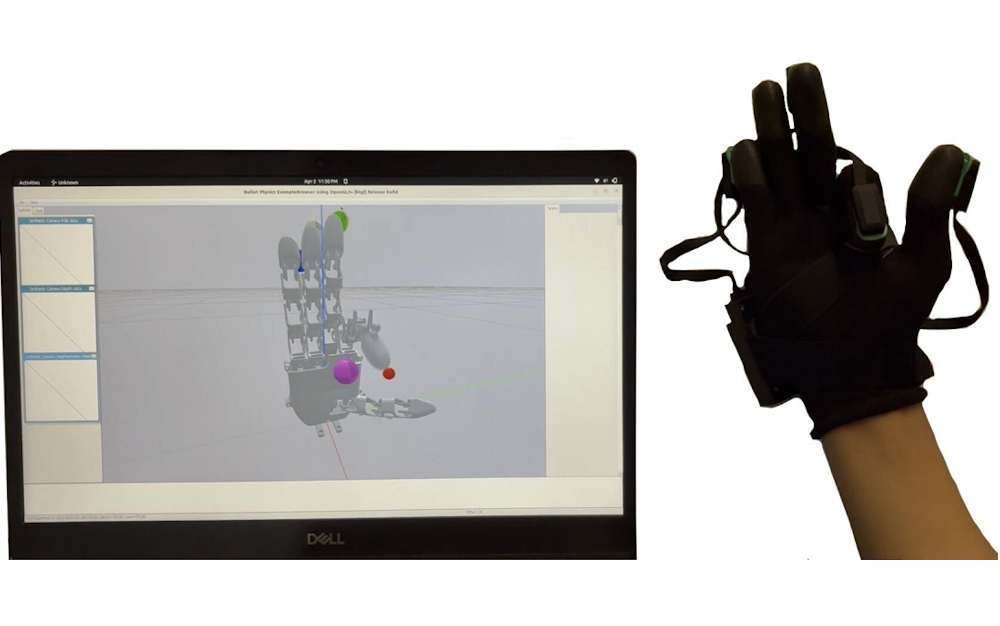

# Setup
Requires a machine that can run [Ubuntu Linux 22.04](https://docs.ros.org/en/humble/Installation/Alternatives/Ubuntu-Development-Setup.html) and the installation of [ROS 2 Humble](https://docs.ros.org/en/humble/index.html).

### MANUS SDK
- Download the required packages to run the "Core Integrated" MANUS SDK C++ in Linux by following [MANUS Instructions](https://docs.manus-meta.com/2.4.0/Plugins/SDK/Linux/)

- After downloading, run the [MANUS SDK](https://github.com/Soltanilara/Krysalis_Hand/tree/6109bbc9e07616c5b7049191f57431e49df69b65/SDKClient_Linux). 

### ROS2 Workspace
1. Clone the Repository, this is your ROS2 Workspace 
```bash
git clone https://github.com/JustinChang04/glove_ROS.git
```

2. Change the left and right glove serial number to match your own MANUS Glove
```bash
cd src/glove/glove/read_and_send_zmq.py
```

3. Upload your URDF File and its STL files in the robot_hand file
```bash
cd src/telekinesis/robot_hand
```

4. Install the necessary libraries 
```bash
pip install pybullet
pip install rclpy
```
<div status = "center">
    
</div> 

# Documentation
There are certain sections of the code you need to look out for when it comes to 


# Instructions

1. Before any actions, run
```bash
source /opt/ros/humble/setup.bash
source ~/glove_ROS/install/setup.bash
```

2. To build the script, cd into the glove_ROS workspace and run
```bash
colcon build
```

3. To run leap_v1_ik.py, from the workspace folder, in a seperate Terminal, cd into src/launch, and run
```bash
ros2 launch ik_launch.py
```
